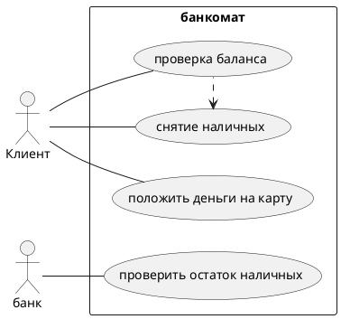

# 1-я лабораторная работа, выполнена 25.02.2023

```plantuml
@startuml "Лабораторная работа 1"
left to right direction 
skinparam packageStyle rect
actor Клиент
actor банк
rectangle банкомат {
Клиент -- (проверка баланса)
Клиент -- (снятие наличных) 
Клиент -- (положить деньги на карту)
(снятие наличных) <. (проверка баланса)
банк -- (проверить остаток наличных) 
}
@enduml
```
