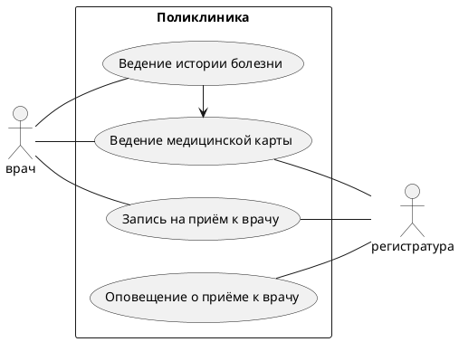
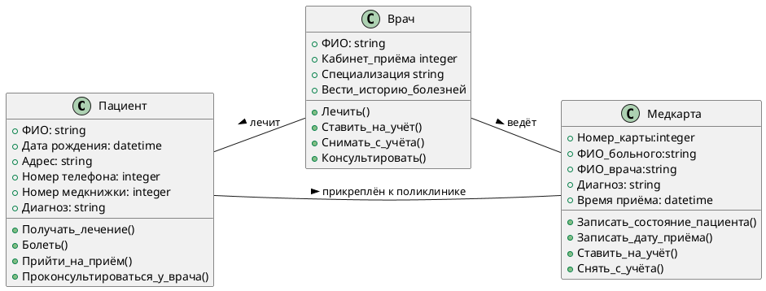
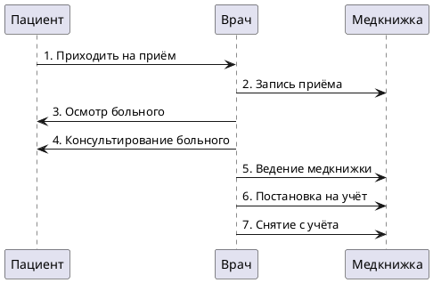
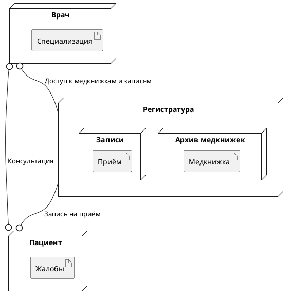

# UML-диаграмма поликлиники

## UML-диаграмма отношения Врач-Поликлиника-Регистратура

```plantuml
@startuml "Поликлиника - диаграмма системы"
left to right direction
skinparam packageStyle rect
actor регистратура
actor врач
rectangle Поликлиника {
(Ведение медицинской карты) -- регистратура
врач -- (Ведение истории болезни)
(Ведение медицинской карты) <- (Ведение истории болезни)
врач -- (Ведение медицинской карты)
врач -- (Запись на приём к врачу)
(Запись на приём к врачу) -- регистратура
регистратура -- (Оповещение о приёме к врачу)
}
@enduml
```

## Диаграмма классов

```plantuml
@startuml "Поликлиника - классы"
left to right direction
class Пациент{
    +ФИО: string
    +Дата рождения: datetime
    +Адрес: string
    +Номер телефона: integer
    +Номер медкнижки: integer
    +Диагноз: string
    +Получать_лечение()
    +Болеть()
    +Прийти_на_приём()
    +Проконсультироваться_у_врача()
}

class Врач{
    +ФИО: string
    +Кабинет_приёма integer
    +Специализация string
    +Лечить()
    +Ставить_на_учёт()
    +Снимать_с_учёта()
    +Вести_историю_болезней
    +Консультировать()
}

class Медкарта{
    +Номер_карты:integer
    +ФИО_больного:string
    +ФИО_врача:string
    +Диагноз: string
    +Время приёма: datetime
    +Записать_состояние_пациента()
    +Записать_дату_приёма()
    +Ставить_на_учёт()
    +Снять_с_учёта()
}

Пациент -- Медкарта: > прикреплён к поликлинике
Врач -- Медкарта: ведёт > 
Пациент -- Врач: < лечит
@enduml
```

## Диаграмма последовательности

```plantuml
@startuml "Поликлиника - последовательность"
participant Пациент
participant Врач
participant Медкнижка
Пациент -> Врач: 1. Приходить на приём
Врач -> Медкнижка: 2. Запись приёма
Врач -> Пациент: 3. Осмотр больного
Врач -> Пациент: 4. Консультирование больного
Врач -> Медкнижка: 5. Ведение медкнижки
Врач -> Медкнижка: 6. Постановка на учёт
Врач -> Медкнижка: 7. Снятие с учёта
@enduml
```

## Диаграмма развёртывания

```plantuml
@startuml "Диаграмма развёртывания"
top to bottom direction

node Пациент{
    artifact "Жалобы"
}

node Врач{
    artifact "Специализация"
}

Врач 0--0 Пациент: Консультация
node Регистратура{
node "Архив медкнижек" {
    artifact "Медкнижка"
}
node Записи{
artifact "Приём"
}
}

Регистратура --0 Пациент: Запись на приём
Врач 0-- Регистратура: Доступ к медкнижкам и записям
@enduml
```
