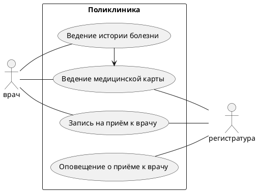
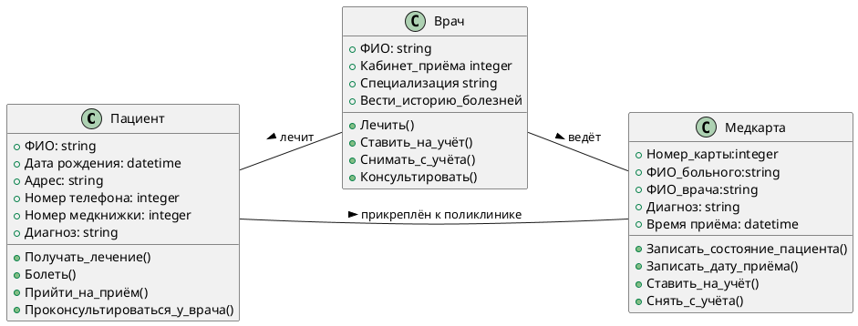

# UML-диаграмма поликлиники

## UML-диаграмма отношения Врач-Поликлиника-Регистратура

```plantuml
@startuml "Поликлиника - диаграмма системы"
left to right direction
skinparam packageStyle rect
actor регистратура
actor врач
rectangle Поликлиника {
(Ведение медицинской карты) -- регистратура
врач -- (Ведение истории болезни)
(Ведение медицинской карты) <- (Ведение истории болезни)
врач -- (Ведение медицинской карты)
врач -- (Запись на приём к врачу)
(Запись на приём к врачу) -- регистратура
регистратура -- (Оповещение о приёме к врачу)
}
@enduml
```

## UML-диаграмма классов

```plantuml
@startuml "Поликлиника - классы"
left to right direction
class Пациент{
    +ФИО: string
    +Дата рождения: datetime
    +Адрес: string
    +Номер телефона: integer
    +Номер медкнижки: integer
    +Диагноз: string
    +Получать_лечение()
    +Болеть()
    +Прийти_на_приём()
    +Проконсультироваться_у_врача()
}

class Врач{
    +ФИО: string
    +Кабинет_приёма integer
    +Специализация string
    +Лечить()
    +Ставить_на_учёт()
    +Снимать_с_учёта()
    +Вести_историю_болезней
    +Консультировать()
}

class Медкарта{
    +Номер_карты:integer
    +ФИО_больного:string
    +ФИО_врача:string
    +Диагноз: string
    +Время приёма: datetime
    +Записать_состояние_пациента()
    +Записать_дату_приёма()
    +Ставить_на_учёт()
    +Снять_с_учёта()
}

Пациент -- Медкарта: > прикреплён к поликлинике
Врач -- Медкарта: ведёт > 
Пациент -- Врач: < лечит
@enduml
```
